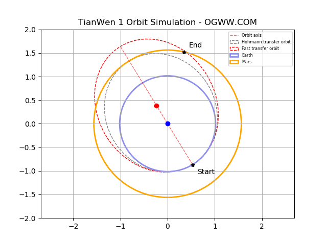

English | [简体中文](./README.CN.md) 

Hohmann transfer orbit Tianwen-1
========

#### 👽👽👽 Use python to simulate the Hohmann transfer orbit of Tianwen-1 👽👽👽 ####

*This project belongs to [OGWW](https://github.com/elliottssu/ogww)。*

The Tianwen-1 Mars Rover from Earth to Mars uses an improved [hohmann transfer orbit](https://en.wikipedia.org/wiki/Hohmann_transfer_orbit) (fast transfer orbit), starting from the earth, The focus is on the elliptical trajectory on a straight line from the earth at the time of departure to Mars at the time of arrival.



## Get Start 🚀
`python3 hohmann.py`

For a better experience, please use python3.6 or above.

## Introduction
**Ideas for drawing an elliptical orbit:**
1. According to [NASA JPL Horizons](https://ssd.jpl.nasa.gov/?horizons), we can get the current planetary trajectory and position data, so based on the daily position data, we can establish Mars and the earth The coordinate position.
```python
# Earth/starting point
AX = 0.5293788380171227
AY = -0.8669958827267433
```

2. The long axis of the fast transfer orbit is still on the same straight line as the standard one, and then an elliptic curve is simulated, where the intersection with the orbit of Mars is at the coordinates near February 11, 2021. So based on this, the center, major axis, and minor axis of the ellipse can be determined.
```python
# Difference between two coordinates
height = abs(AY-BY)
width = abs(AX-BX)

# Ellipse included angle
angle = math.atan(width/height) * 180 / math.pi

# 2a Long shaft length
aFull = math.sqrt(pow(abs(AX-BX), 2) + pow(abs(AY-BY), 2))

# Slope b=0
k = (AY-BY)/(AX-BX)

# Ellipse center coordinates
centerX = (AX+BX)/2
centerY = k*centerX

```

3. Use the elliptic equation and the one-dimensional quadratic equation to solve all the coordinate points on the curve.

**To do:**
The distance between the two points on the X axis of the generated point coordinates and the corresponding ellipse arc lengths should be equal, so as to ensure a uniform speed. But this will be more troublesome to implement (currently only roughly divide the interval).

*You can also visit [https://www.ogww.com/tianwen-1](https://www.ogww.com/tianwen-1) for more project details. *
